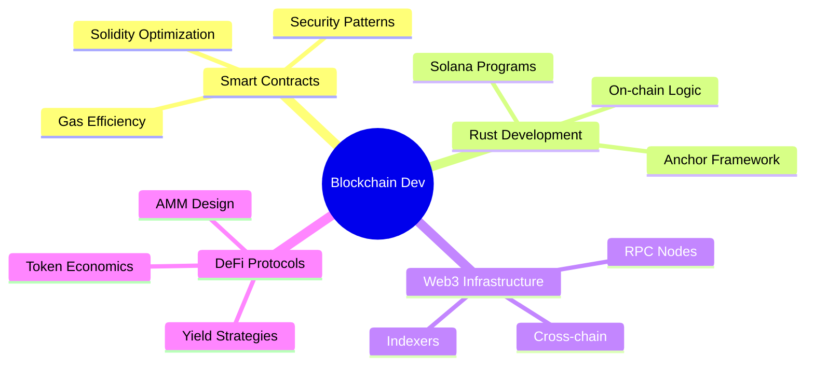

<div align="center">

<!-- Animated Header -->


<!-- Typing Animation -->
<a href="https://git.io/typing-svg">
  
</a>

<br/>

<!-- Social Badges with Animation -->
<p align="center">
  <a href="https://linkedin.com/in/iamrakki">
    
  </a>
  <a href="mailto:rakkiramesh4@gmail.com">
    
  </a>
  <a href="https://github.com/iamrakki">
    
  </a>
</p>

<!-- Profile Views with Custom Styling -->


</div>

---

## 🌟 About Me

```rust
struct BlockchainDeveloper {
    name: String,
    role: String,
    experience_years: u8,
    location: String,
    current_focus: Vec<String>,
}

impl BlockchainDeveloper {
    fn new() -> Self {
        Self {
            name: "Rakki R".to_string(),
            role: "Blockchain Developer".to_string(),
            experience_years: 3,
            location: "Ambattur, Tamil Nadu, IN".to_string(),
            current_focus: vec![
                "Advanced Smart Contract Patterns".to_string(),
                "Rust Blockchain Development".to_string(),
                "Web3 Infrastructure".to_string(),
                "Cross-chain Architecture".to_string(),
            ],
        }
    }
}
```


### 👨‍💻 What I Do

- 🔐 **Smart Contract Development** - Building secure, gas-optimized contracts
- 🌉 **Cross-chain Solutions** - Designing bridges and multi-chain protocols
- 🏢 **Enterprise Blockchain** - Hyperledger Fabric network implementation
- 💰 **DeFi Protocols** - Token systems, AMMs, and yield strategies
- 🔍 **Security First** - Comprehensive auditing and testing practices

### 🎯 Current Mission

```typescript
const currentGoals = {
  learning: ["Advanced Rust patterns", "Zero-knowledge proofs", "MEV strategies"],
  building: ["Solana programs", "EVM-compatible protocols", "Cross-chain bridges"],
  exploring: ["Layer 2 solutions", "Account abstraction", "Modular blockchains"]
};
```

<br clear="right"/>

---

## 🛠️ Technology Arsenal

<div align="center">

### **Blockchain & Smart Contracts**

<p>
  
  
  
  
  
</p>

### **Backend & Development**

<p>
  
  
  
  
  
</p>

### **DevOps & Infrastructure**

<p>
  
  
  
  
  
</p>

### **Development Tools**

<p>
  
  
  
  
  
</p>

</div>

---

## 📊 GitHub Analytics

<div align="center">
  
  
</div>

<div align="center">
  
  
</div>

---

## 🏆 GitHub Trophies

<div align="center">
  
</div>

---

## 🔥 Contribution Streak

<div align="center">
  
</div>

---

## 💼 Professional Expertise

<table>
<tr>
<td width="50%">

### 🔐 Smart Contract Development
- ✅ ERC-20/721/1155 token standards
- ✅ DeFi protocol architecture
- ✅ Gas optimization techniques
- ✅ Security-first development
- ✅ Comprehensive testing & auditing

</td>
<td width="50%">

### 🌉 Cross-chain & Infrastructure
- ✅ Bridge protocol design
- ✅ Multi-chain deployment
- ✅ Node infrastructure setup
- ✅ Performance monitoring
- ✅ DevOps automation

</td>
</tr>
</table>

---

## 📈 Weekly Development Breakdown

<!--START_SECTION:waka-->
```text
Solidity     12 hrs 30 mins  ████████████░░░░░░░░░  48.2%
Rust         6 hrs 15 mins   ██████░░░░░░░░░░░░░░░  24.1%
Hyperledger  4 hrs 20 mins   ████░░░░░░░░░░░░░░░░░  16.7%
TypeScript   3 hrs 20 mins   ███░░░░░░░░░░░░░░░░░░  15.7%
Go           2 hrs 10 mins   ██░░░░░░░░░░░░░░░░░░░   8.4%
Other        0 hrs 40 mins   ░░░░░░░░░░░░░░░░░░░░░   2.6%
```
<!--END_SECTION:waka-->

---

## 🎯 Current Focus Areas

<div align="center">



</div>

---

## 🌐 Connect & Collaborate

<div align="center">

### 💬 Let's Build the Decentralized Future Together!

<p>
  <a href="https://linkedin.com/in/iamrakki">
    
  </a>
  <a href="mailto:rakkiramesh4@gmail.com">
    
  </a>
</p>

### 📫 Open for:
✨ Smart Contract Development | 🤝 Collaboration Opportunities | 💼 Consulting Projects | 🎓 Knowledge Sharing

---


<sub>⭐️ From [iamrakki](https://github.com/iamrakki) | Built with 💙 and ☕</sub>

</div>
